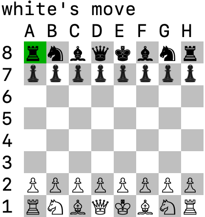
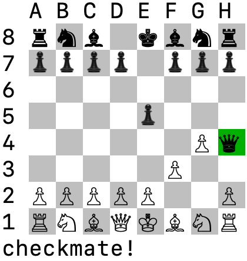

# Chess



This is a simple console-based version of the classic board game chess, coded in Ruby.

# Setup and Controls

* Setup
 * Clone repository and open in terminal.
 * In terminal, run "ruby game.rb".


* Controls
  * WASD or directional keys to move the cursor.
  * Press Space or Enter to select a piece, then select the space you wish to move the piece to.
  * Game ends when one player is checkmated.

# Feature Highlights

* Piece movement


Pieces are categorized into three different types of movement: sliding, stepping, and pawns. Sliding pieces (bishops, queens, rooks) may move in a direction until they encounter another piece. Stepping pieces (kings and knights) may move in a certain way in a direction. Pawns are unique in that they may only capture diagonally, but are otherwise restricted to only forward movements (direction depending on color).

* Check and checkmate



After each move, the game will check if the board is in a state of check or checkmate. After a move is submitted, game will also check if the move will result in the current player's own color being in check.

**game.rb**
```ruby
def play
  until self.board.checkmate?(:white) || self.board.checkmate?(:black)
    system("clear")
    begin
      puts "check (#{self.current_player.color})" if self.board.in_check?(self.current_player.color)
      puts "#{self.current_player.color}'s move"
      self.current_player.make_move(self.board)
    rescue StandardError => e
      system("clear")
      puts e.message
      retry
    end
    swap_turn!
  end
  notify_players
end
```

**board.rb**
```ruby
def checkmate?(color)
  own_pieces = pieces.select {|piece| piece.color == color}
  own_pieces.all?{|piece| piece.valid_moves.empty?} && in_check?(color)
end

def in_check?(color)
  king_pos = find_king(color)
  opposing_pieces = pieces.select do |piece|
    color == :white ? piece.color == :black : piece.color == :white
  end
  opposing_pieces.any?{|piece| piece.moves.include?(king_pos)}
end
```

To determine if moving a piece will result in the player in check, the piece is moved on a duplicate version of the current board state, and in_check? is performed on the duplicate.

**piece.rb**
```ruby
def move_into_check?(end_pos)
  board_dup = self.board.dup
  board_dup.move_piece!(self.pos, end_pos)
  board_dup.in_check?(self.color)
end
```

# Future Directions
* Implement AI opponent
* Advanced moves (castling, en passant)
